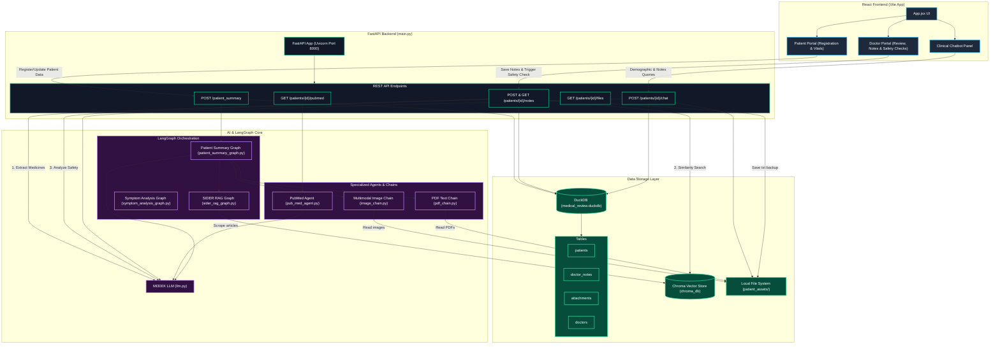

# Project Architecture Diagram

This document describes the high-level architecture of the **LangGraph Guardian** system, detailing the interactions between the React frontend, the FastAPI backend server, database systems, LangGraph nodes, and AI agents.

## Architecture Overview

---

## Component Breakdown

### 1. React Frontend (Vite)
- **App.jsx**: The master dashboard view containing:
  - **Patient Portal**: Renders forms to save names, vitals, active medications, ailments, and upload patient lab reports (PDF/images).
  - **Doctor Portal**: Allows reviewing symptoms, clinical records, and writing **Clinical Consultation Notes**. On saving, it displays a safety dialog highlighting any potential adverse drug-drug interactions or warnings.
  - **Clinical Chatbot**: A chat panel helping doctors query patient information using RAG and chatbot context.

### 2. FastAPI Backend Service (`main.py`)
- Acts as the orchestration and API gateway.
- Receives HTTP POST/GET requests and interfaces directly with the DuckDB database, Chroma DB, and LangGraph modules.

### 3. Data Storage Layer
- **DuckDB (`medical_review.duckdb`)**: Embedded relational database that maintains patient records, uploads, doctor metadata, and clinical consultation notes.
- **Chroma DB (`chroma_db/`)**: Local vector database containing SIDER (Side Effect Resource) drug profiles chunked and indexed. Used for similarity searches to retrieve side-effect profiles during clinical RAG checks.
- **Local File System (`patient_assets/`)**: Disk storage containing uploaded patient files (PDFs, X-rays/images) and text backups (`global_data.txt` and `doctor_notes.txt`) for LLM context grounding.

### 4. AI & LangGraph Core
- **LangGraph Engines**:
  - **Patient Summary Graph**: Runs file ingestion (OCR/Multimodal images/PDFs), queries SIDER RAG for active medications, and generates a concise, context-grounded history summary.
  - **SIDER RAG Graph**: A standard query-retrieve-generate RAG pipeline over Chroma DB drug records.
  - **Symptom Analysis Graph**: Parses clinical logs to isolate matching symptoms and match severity.
- **Agents & Chains**:
  - **PubMed Agent**: A tool-equipped agent that scrapes PubMed dynamically to research medical findings about patient conditions.
  - **Image & PDF Chains**: Lightweight LangChain pipes utilizing multimodal LLM prompts to extract structured text from reports.
